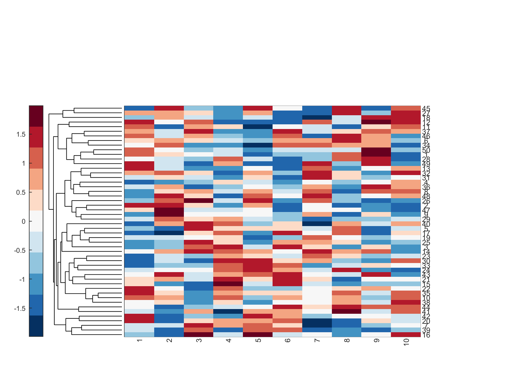

# cluster_heatmap_gene_expression
MATLAB script that plots clustered heatmap of log-folded gene expressions

It reads a tab delimited log-folded gene extressions and draw clustered heatmap.

Example input file looks like
Genes lib1  lib2  lib3
gene1 0.11  0.12  0.02
gene2 -0.12 1.10  0.54
gene3 ...

Example output picture will liik like

